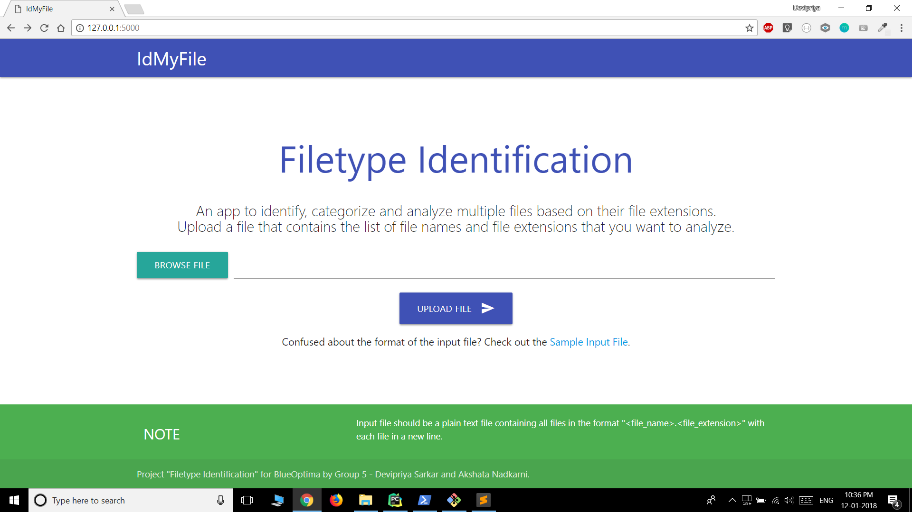
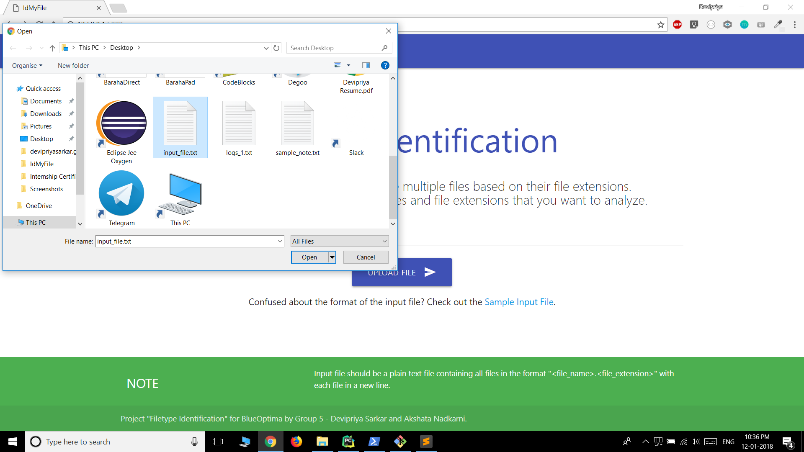
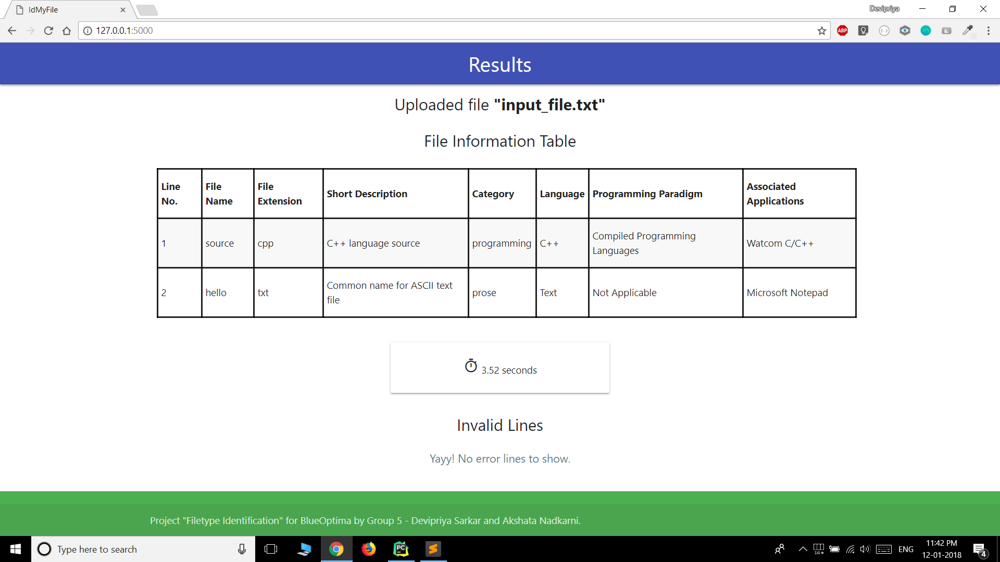

# IdMyFile

An app to identify, categorize and analyze multiple files based on their file extensions.   
Project "Filetype Identification" for BlueOptima by Group 5 - Devipriya Sarkar and Akshata Nadkarni.

# Setup Instructions

* ## Using PyCharm
    1. Make sure python 2.7 is installed on your system.
    2. Un-zip the directory.
    3. Open PyCharm. Browse to the root project directory (immediate parent of ````IdMyFile.py````) and open it.
    4. Install all requirements in ```requirements.txt```.
    5. Run the project.
    6. Go to [http://127.0.0.1:5000/](http://127.0.0.1:5000/) or [http://localhost:5000/](http://127.0.0.1:5000/) to check the web app.
        > Note: By default, [flask](http://flask.pocoo.org/) runs on port 5000.
    7. Upload a "plain text file" containing the list of file names and extensions in the format ```<file_name>.<file_extension>``` .
       A sample test file ```sample_input_file.txt``` is there in the project directory for reference.
    8. The result page shows a table with file information and the invalid lines in the input file are showed in the "Invalid Lines" section.
        > Quick Information: The regular expression used for matching the valid file name is ```^([\w_\.]+)(\.)([\w]*)$```.
    
* ## Using command line
    1. Make sure python 2.7 is installed on your system.
    2. Un-zip the directory.
    3. Install all the packages in ```requirements.txt```.
           To install using pip, run ```pip install -r requirements.txt``` from the project directory.
           > Check if you have pip installed by using ```pip -V``` on your command line.
           > If you do not have [pip](https://pip.pypa.io/en/stable/installing/) installed, install pip by securely downloading [get-pip.py](https://bootstrap.pypa.io/get-pip.py). Then run the command ```python get-pip.py``` .
    
    4. To run the application,
            On Linux,
                
                        $ export FLASK_APP=IdMyFile.py               
                        $ flask run         
                            * Running on http://127.0.0.1:5000/ (Press CTRL+C to quit)                 
                
            or
                
                        $ export FLASK_APP=IdMyFile.py          
                        $ python -m flask run           
                            * Running on http://127.0.0.1:5000/ (Press CTRL+C to quit)  
           
           On Windows cmd (not PowerShell),
           
                        $ set FLASK_APP=IdMyFile.py               
                        $ flask run         
                            * Running on http://127.0.0.1:5000/ (Press CTRL+C to quit)
    
    5. Go to [http://127.0.0.1:5000/](http://127.0.0.1:5000/) or [http://localhost:5000/](http://127.0.0.1:5000/) to check the web app.
        > Note: By default, [flask](http://flask.pocoo.org/) runs on port 5000.
    6. Upload a "plain text file" containing the list of file names and extensions in the format ```<file_name>.<file_extension>``` .
       A sample test file ```sample_input_file.txt``` is there in the project directory for reference.
    7. The result page shows a table with file information and the invalid lines in the input file are shown in the "Invalid Lines" section.
        > Quick Information: The regular expression used for matching the valid file name is ```^([\w_\.]+)(\.)([\w]*)$```.
        
# Screenshots

* First Screen



* Browse Input File



* Result Screen

